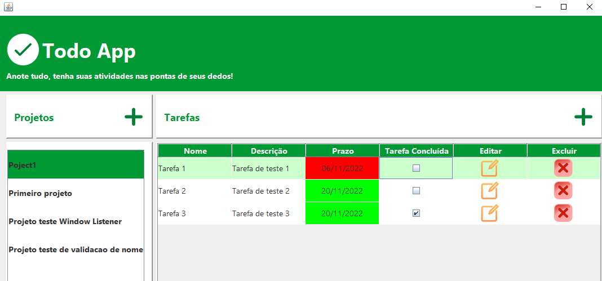

# TodoApp
<h2> Project Description <h2>

 This is an application developed in the Start By Capgemini program. It was developed over the course of Programming Logic and Algorithms III.

 The objective of the TodoApp application is to create a place where it is possible to set projects, their respective tasks, deadlines, description and status. 
For the development of this application it was used Java language to set the controllers and models, and the Swing toolkit to create the graphical interface
of the views

 An image of the main view created is presented below

  
